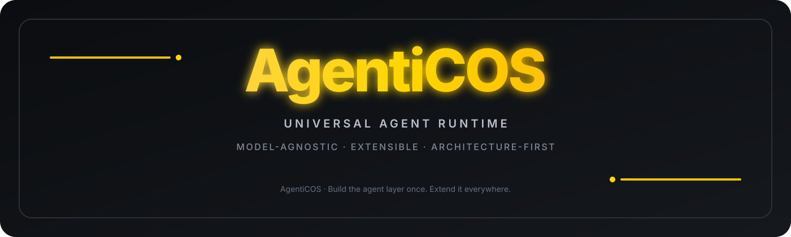

  

# AgentiCOS

  
  
  

AgentiCOS is being designed as a universal, model-agnostic agent runtime and application platform.

## Architecture-first

Before broad implementation, the repository freezes the complete product architecture:

- one Rust-first runtime for CLI, TUI, Web, Desktop, IDE, API, SDK and messaging;
- multi-provider AI access for free-tier, paid, local and custom APIs;
- typed task/run/thread/turn/step/item execution;
- pluggable tools, sandboxes, memory, skills, workflows and agents;
- asynchronous and parallel child agents;
- first-class artifacts and verification;
- durable sessions, persistence, replay and recovery;
- capability-based security and explicit approvals;
- plugin, protocol and engine-adapter architecture;
- Source Forge plus a mandatory Reference Knowledge Corpus for evidence-driven implementation;
- Rust-native token/context optimization with lossless tool-output compaction, deduplication, compact structured encoding, delta sync, budgeting, recovery and measurable caching.

## Reference architecture

The design studies current public architectures from:

- Hermes Agent;
- DeepSeek Harness;
- OpenAI Codex;
- FreeLLMAPI;
- Google Antigravity;
- OmniRoute;
- Rust token-optimization references: trimcp, sqz, gcf-rust, Ogham and RTK.

These are architectural and implementation references. AgentiCOS defines its own contracts and security boundaries instead of treating any one project as the product core.

[Reference Knowledge Corpus →](./docs/architecture/REFERENCE-KNOWLEDGE-CORPUS.md)

[Token Optimization Architecture →](./docs/architecture/TOKEN-OPTIMIZATION-ARCHITECTURE.md)

## Source Forge

Source Forge can import complete repositories, preserve source snapshots and commits, audit licenses and dependencies, extract capabilities, build evidence packs, compare implementations and prepare integration proposals.

The target is to combine useful implementations from multiple projects while retaining provenance and keeping AgentiCOS-owned code behind stable contracts.

## Current status

Provider Engine and Source Forge prototypes exist. The repository is now in an architecture-first stage; production feature implementation should follow the architecture documents before expanding the prototypes.

Read [ARCHITECTURE.md](./ARCHITECTURE.md) first.

Then read [docs/architecture/README.md](./docs/architecture/README.md).

## References

- Hermes Agent: https://github.com/NousResearch/hermes-agent
- DeepSeek Harness: https://github.com/deepseek-ai/deepseek-harness
- OpenAI Codex: https://github.com/openai/codex
- FreeLLMAPI: https://github.com/tashfeenahmed/freellmapi
- OmniRoute: https://github.com/diegosouzapw/OmniRoute
- trimcp: https://github.com/rustkit-ai/trimcp
- sqz: https://github.com/ojuschugh1/sqz
- gcf-rust: https://github.com/blackwell-systems/gcf-rust
- Ogham: https://github.com/signalbreak-labs/ogham
- RTK: https://github.com/rtk-ai/rtk
- Google Antigravity: https://antigravity.google/docs/ide/overview

---

  <strong>AgentiCOS</strong> · Universal, model-agnostic agent infrastructure designed around stable contracts, extensibility and verifiable execution.

  Build the agent layer once. Extend it everywhere.

